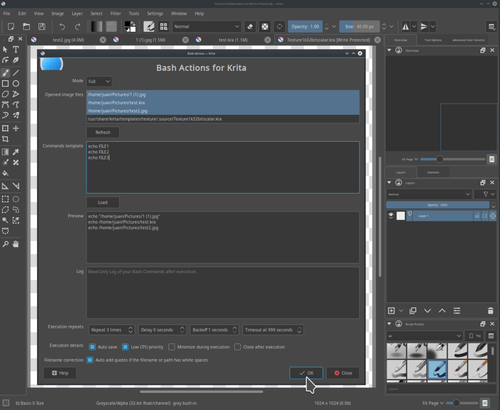
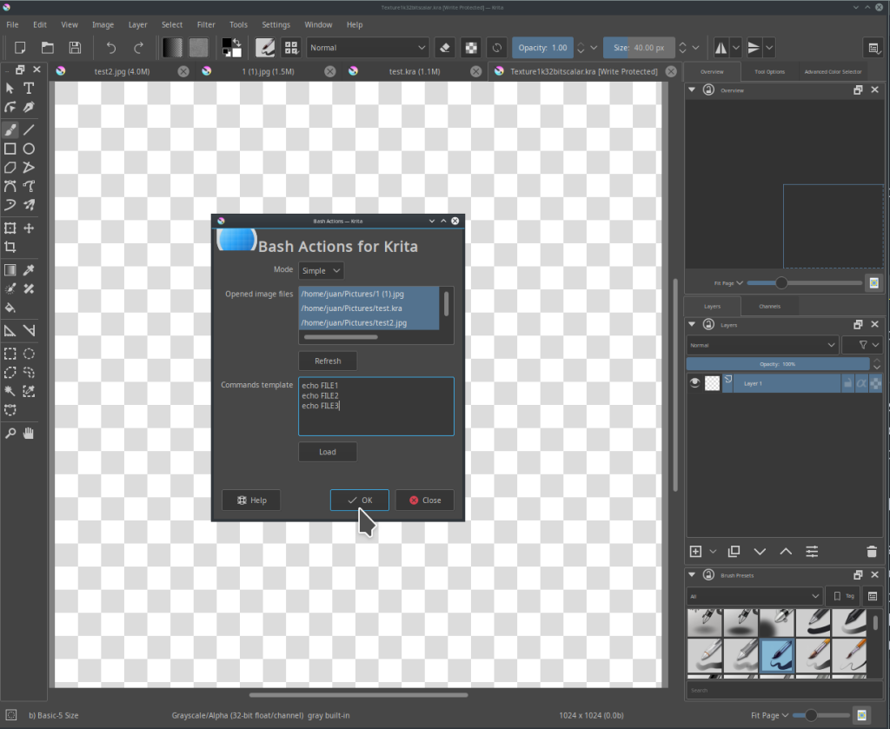

# krita-plugin-bashactions

Plugin to execute Bash commands and programs as Actions on your current Images from Krita.

# Install

- Copy all files to `~/.local/share/krita/pykrita/` and restart Krita.
- Go to `Settings → Configure Krita → Python Plugin Manager → BashActions`, Enable it and restart Krita.
- Go to `Tools → Scripts → BashActions`.

**Uninstall:**

- Go to `Settings → Configure Krita → Python Plugin Manager → BashActions`, Disable it and restart Krita.
- Delete all files from `~/.local/share/krita/pykrita/bashactions/`.

# Requisites

- Python 3.6+.
- Qt 5+.
- Krita 4+.
- Linux or OsX.

# Description

    The GUI has on top your current opened image files on Krita with its full path, 
    then on Commands Template you can type or paste Bash commands to execute, 
    1 per line, you can repeat lines to repeat the operation, 
    the words "FILE1" in uppercase will be replaced with your first selected image file, 
    the words "FILE2" in uppercase will be replaced with your second selected image file, 
    the words "FILE3" in uppercase will be replaced with your third selected image file, 
    and so on, you can repeat those words, you can put as many as you want or none, 
    that way you can format commands quickly without having to type long complicated
    full paths of your current opened images on Krita, 
    it will automatically add Quotes if the filename or path contains white spaces, 
    to avoid errors on Bash commands, it can also repeat the whole commands again, 
    as many as you want or once, also you can set a wait Delay, with a Backoff multiplier, 
    and a Timeout on seconds, the commands run once with no wait by default, 
    the commands are automatically saved to cache txt on execution, 
    the commands can be Loaded from disk as bash or txt files, 
    you can run the commands on low smooth CPU priority if is too resource hog, 
    you can also Minimize the window during commands execution, 
    you can also Close the window after commands execution, 
    theres a Preview that shows you how the commands look like before execution, 
    theres a Log that shows you Standard Output, Standard Error, 
    some useful extra Info from the commands after execution.  
    It has a Mode selector with "Full" (advanced) and "Simple" (basic), 
    following the idea of <i>Simple but Powerful When Needed</i>.  
    Theres a Help button that opens the Plugins GitHub with Source, Docs, etc.

